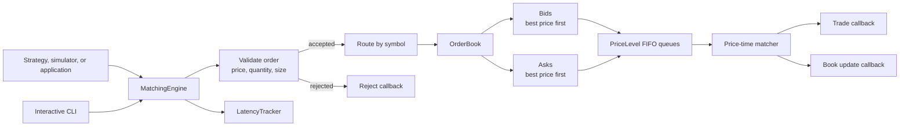
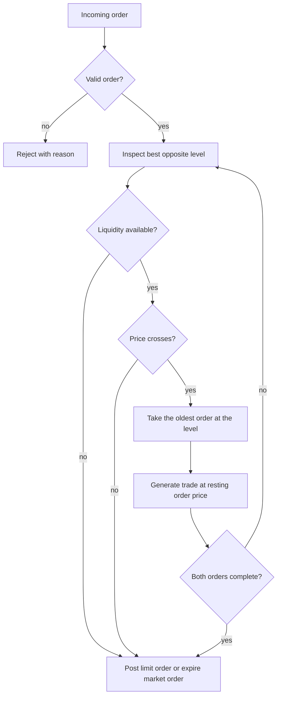

# SableBook

## Deterministic limit order book and matching engine in C++20

[](https://github.com/raogaurav17/SableBook/actions/workflows/ci.yml)
[](https://en.cppreference.com/w/cpp/20)
[](https://cmake.org/)

SableBook is a compact, high-performance limit order book and matching engine for market simulations, exchange prototypes, quantitative research, and systems programming experiments.

The engine is built around explicit price-time priority, predictable order state transitions, multi-instrument routing, and a small C++20 API. It includes an interactive command-line visualizer, a focused test suite, latency benchmarks, and sanitizer-enabled build presets.

> SableBook is an educational and research-oriented engine. It is not an exchange connectivity layer or a complete production trading system.

## Why SableBook

- **Deterministic matching:** Orders execute at the best available price, then in FIFO arrival order within each price level.
- **Limit and market orders:** Supports resting liquidity, aggressive crosses, partial fills, multi-level sweeps, and expiration of unfilled market quantity.
- **Direct order management:** Cancellation and lookup use an order index with stored price-level iterators, avoiding scans through the queue.
- **Amend support:** Quantity reductions can preserve queue position, while price changes and quantity increases are re-queued according to matching rules.
- **Multi-instrument books:** A single `MatchingEngine` coordinates isolated `OrderBook` instances by symbol.
- **Observable execution:** Trade, book update, and rejection callbacks expose engine activity to applications and simulations.
- **Built-in telemetry:** `LatencyTracker` reports count, min, percentile, maximum, mean, and standard deviation statistics.
- **Developer-friendly validation:** CMake presets, compiler coverage, unit tests, AddressSanitizer, UndefinedBehaviorSanitizer, and ThreadSanitizer are included.

## Architecture



### Matching flow



## Core API

The public API is centered on `MatchingEngine`:

```cpp
#include "MatchingEngine.hpp"
#include <iostream>

int main() {
    using namespace sablebook;

    MatchingEngine engine;
    engine.registerSymbol("BTC-USD");

    engine.setTradeCallback([](const Trade& trade) {
        std::cout << trade.symbol << ": "
                  << trade.quantity << " @ " << trade.price << '\n';
    });

    const auto sell_id =
        engine.submitLimitOrder(Side::Sell, 50'000.0, 2, "BTC-USD");
    const auto buy_id =
        engine.submitLimitOrder(Side::Buy, 50'000.0, 2, "BTC-USD");

    const BBO bbo = engine.getBBO("BTC-USD");
    std::cout << "Orders: " << sell_id << ", " << buy_id << '\n';
    std::cout << "Trades: " << engine.totalTradesGenerated() << '\n';
    std::cout << "Book has bid: " << std::boolalpha << bbo.hasBid() << '\n';
}
```

Available operations include:

| Area | Operations |
| --- | --- |
| Submission | Limit orders, market orders, symbol selection, configurable maximum quantity |
| Lifecycle | Cancel, modify, status lookup, order lookup, reset |
| Market data | Best bid and offer, spread, mid-price, aggregated depth |
| Events | Trade, book update, and rejection callbacks |
| Telemetry | Orders processed, trades generated, latency samples and statistics |

Order validation returns explicit `RejectReason` values for invalid prices, invalid quantities, missing orders, terminal orders, size-limit violations, and unknown instruments.

## Build and run

### Requirements

- C++20 compiler: GCC, Clang, or MSVC
- CMake 3.20 or newer
- A build environment with CTest support

### Recommended: CMake presets

Each preset uses a separate build directory.

```bash
# Optimized build with CLI, tests, and benchmarks
cmake --preset release
cmake --build --preset release
ctest --preset release

# Debug build
cmake --preset debug
cmake --build --preset debug

# AddressSanitizer and UndefinedBehaviorSanitizer
cmake --preset asan
cmake --build --preset asan
ctest --preset asan

# ThreadSanitizer
cmake --preset tsan
cmake --build --preset tsan
ctest --preset tsan
```

### Run the executables

```bash
./build-release/sablebook_cli
./build-release/sablebook_tests
./build-release/sablebook_bench
```

The engine and its containers are designed for deterministic single-threaded use. ThreadSanitizer is provided for validating integrations and future concurrency work, but the core API does not add synchronization.

## Interactive CLI

The CLI provides a colored depth ladder, BBO and spread queries, order lifecycle commands, statistics, and a reproducible market simulation.

| Command | Description | Example |
| --- | --- | --- |
| `limit buy <price> <qty> [symbol]` | Submit a limit buy | `limit buy 100.50 10 BTC-USD` |
| `limit sell <price> <qty> [symbol]` | Submit a limit sell | `limit sell 102.00 15 BTC-USD` |
| `market buy <qty> [symbol]` | Submit a market buy | `market buy 5 BTC-USD` |
| `market sell <qty> [symbol]` | Submit a market sell | `market sell 8 BTC-USD` |
| `cancel <order_id>` | Cancel a resting order | `cancel 1` |
| `modify <order_id> <price> <qty>` | Modify an order | `modify 1 101.00 20` |
| `status <order_id>` | Inspect order state and fills | `status 1` |
| `book [symbol] [levels]` | Display depth | `book BTC-USD 5` |
| `bbo [symbol]` | Display best bid, ask, and spread | `bbo BTC-USD` |
| `sim [count]` | Run a live simulation | `sim 30` |
| `stats` | Display engine statistics | `stats` |
| `help` or `exit` | Show help or leave the CLI | `help` |

## Tests and benchmarks

The test suite covers:

- Empty books, BBO, and depth aggregation
- Exact matches, partial fills, multi-level sweeps, and FIFO behavior
- Limit and market order semantics
- Cancellation at the head, middle, and tail of a price-level queue
- Order modification and validation failures
- Multiple instruments and book update callbacks

The benchmark executable runs four workloads with 200,000 events each:

1. Resting limit order insertion
2. Random order cancellation
3. Active matching
4. A mixed workload containing limit orders, cancellations, market orders, and modifications

Benchmark results depend on compiler, hardware, operating system, and build configuration. Run `sablebook_bench` locally before using numbers for comparison.

## Project layout

```text
SableBook/
+-- include/
|   +-- MatchingEngine.hpp   # Multi-instrument coordinator and public engine API
|   +-- Metrics.hpp          # Latency sampling and percentile statistics
|   +-- Order.hpp            # Order model and lifecycle helpers
|   +-- OrderBook.hpp        # Book operations and matching entry points
|   +-- PriceLevel.hpp       # FIFO queue and aggregated level quantity
|   +-- Trade.hpp            # Trade event model
|   +-- Types.hpp            # Sides, order types, states, rejects, BBO, and depth
+-- src/
|   +-- MatchingEngine.cpp   # Validation, routing, callbacks, and lifecycle management
|   +-- OrderBook.cpp        # Matching and book mutation
|   +-- main.cpp             # Interactive CLI
+-- tests/                   # Unit tests and lightweight test framework
+-- benchmarks/              # Latency and throughput workloads
+-- CMakeLists.txt           # Targets and sanitizer configuration
+-- CMakePresets.json        # Release, debug, ASan, and TSan presets
+-- .github/workflows/ci.yml # Compiler, sanitizer, test, and benchmark checks
```

## Continuous integration

GitHub Actions validates the project on pushes and pull requests to `master` with:

- GCC 13 and Clang 18
- Debug and Release builds
- CTest execution
- AddressSanitizer and UndefinedBehaviorSanitizer
- ThreadSanitizer
- A Release benchmark smoke test
