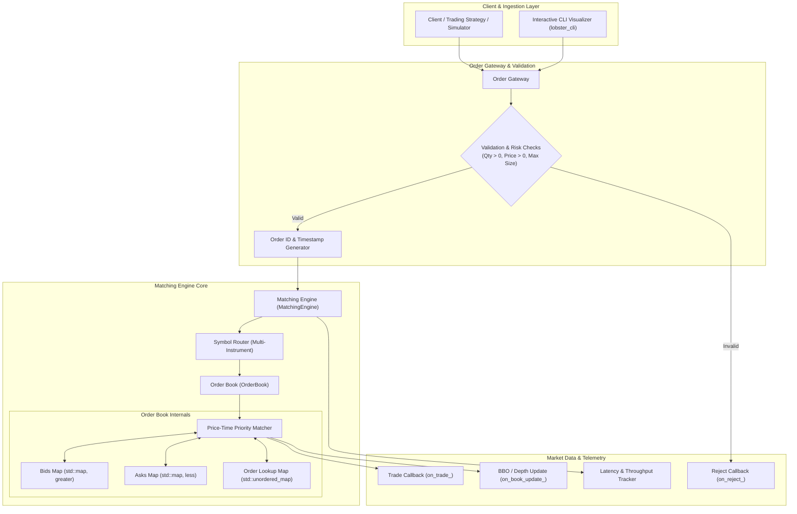
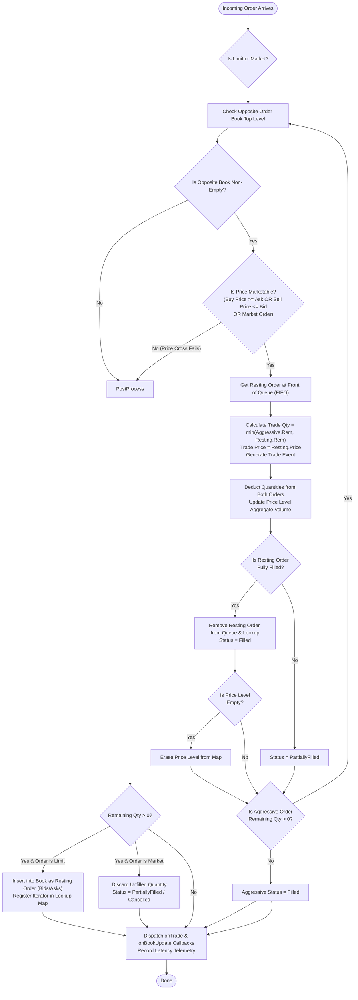
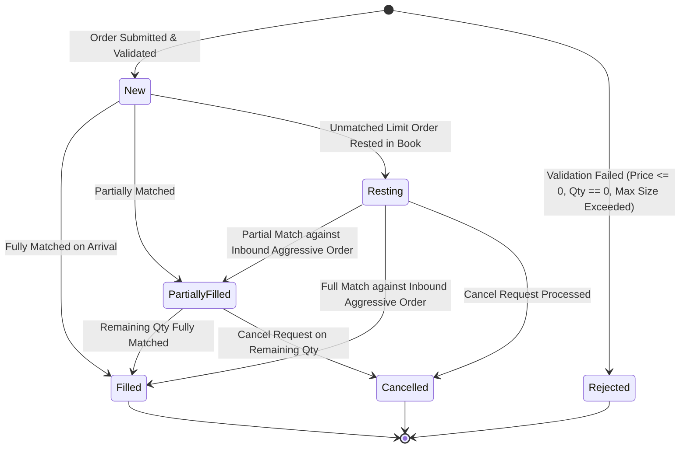
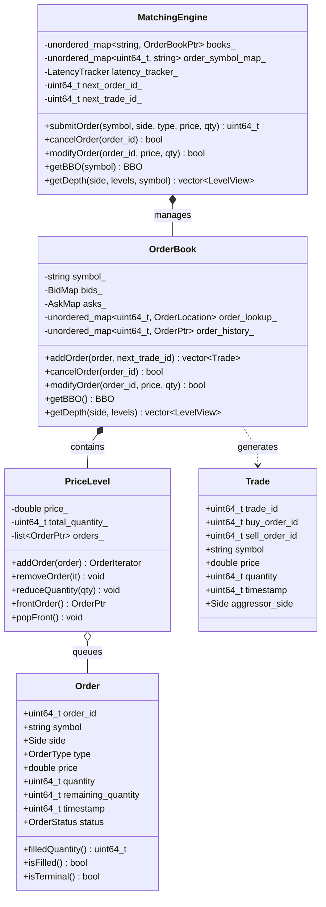

# LOBster — Limit Order Book & Matching Engine

[](https://en.cppreference.com/w/cpp/20)
[](https://isocpp.org/)
[](https://cmake.org/)
[]()
[]()
[]()

**LOBster** is an ultra-low latency, deterministic Limit Order Book (LOB) and Matching Engine written in **Modern C++ (C++20)**. It is architected for financial exchanges, electronic market making, and quantitative trading simulations requiring sub-microsecond execution latencies and strict price-time priority (FIFO) matching guarantees.

---

## Key Highlights

- **Sub-Microsecond Matching**: **0.20 μs** p50 latency, **0.47 μs** p99 latency, and **1.06 μs** average latency on commodity hardware.
- **High Throughput**: **> 1,540,000 orders/sec** in active matching mode and **> 1,090,000 events/sec** under mixed realistic trading workloads.
- **Deterministic Price-Time Priority (FIFO)**: Strict price-first ordering followed by chronological queue execution per price level.
- **$O(1)$ Fast Order Cancellation**: Direct iterator-indexed lookup in $O(1)$ allows immediate removal from any queue position (head, middle, tail) without scanning.
- **Memory Safety & Modern RAII**: Zero memory leaks, zero dangling pointers, cache-conscious memory layouts using standard containers.
- **Multi-Instrument Architecture**: Isolated order books per symbol (`BTC-USD`, `ETH-USD`, `AAPL`, `MSFT`).
- **Interactive Visualizer & REPL**: Real-time ANSI-colored depth ladder, live market simulation, and instant BBO spread calculations.

---

## Performance Benchmarks

All benchmarks were evaluated using high-resolution monotonic clocks over **200,000 operations per benchmark suite** compiled with GCC in Release mode (`-O3 -march=native`):

| Workload Scenario | Operations | Throughput | p50 Latency | p90 Latency | p99 Latency | Mean Latency |
|---|---|---|---|---|---|---|
| **Active Matching Execution** | 200,000 aggressive orders | **1,542,979 orders/sec** | **0.20 μs** | **0.28 μs** | **0.47 μs** | **1.06 μs** |
| **Mixed Trading Workload** | 200,000 mixed events | **1,097,337 events/sec** | **0.54 μs** | **1.19 μs** | **2.41 μs** | **0.88 μs** |
| **Order Cancellation** | 200,000 random cancels | **323,251 cancels/sec** | **2.48 μs** | **3.58 μs** | **5.25 μs** | **3.07 μs** |
| **Limit Order Insertion** | 200,000 resting orders | **255,328 orders/sec** | **1.98 μs** | **4.12 μs** | **38.14 μs** | **3.85 μs** |

---

## System Architecture



---

## Matching Logic & Execution Flow

When an aggressive order arrives at the engine, matching follows deterministic price-time priority:



---

## Order Lifecycle & State Machine



---

## Data Structure & Memory Model



---

## Requirements Traceability Matrix

| ID | Category | Requirement | Implementation Details | Status |
|---|---|---|---|:---:|
| **FR-1** | Core | Accept Limit Orders | Supported via `submitLimitOrder` / `submitOrder` with Buy/Sell sides | Complete |
| **FR-2** | Core | Accept Market Orders | Immediate liquidity matching; unfilled volume automatically expired | Complete |
| **FR-3** | Core | Price-Time Priority | $O(\log M)$ price lookup via ordered maps, $O(1)$ FIFO execution | Complete |
| **FR-4** | Core | Partial Fills | Accurate reduction on resting maker and aggressive taker orders | Complete |
| **FR-5** | Core | Order Cancellation | $O(1)$ cancellation via iterator index without queue scanning | Complete |
| **FR-6** | Core | Status Tracking | `New`, `PartiallyFilled`, `Filled`, `Cancelled`, `Rejected` tracked | Complete |
| **FR-7** | Core | Trade Generation | Trade event dispatched with maker/taker IDs, price, quantity, timestamp | Complete |
| **FR-8** | Core | BBO & Spread Queries | Constant-time retrieval of Best Bid, Best Offer, Spread, and Mid-Price | Complete |
| **FR-9** | Core | Order Book Depth | Top-$N$ price level aggregation (price, aggregate volume, order count) | Complete |
| **FR-10** | Core | Multiple Orders / Level | FIFO queue per level with aggregate volume increment/decrement | Complete |
| **FR-11** | Advanced | Amend / Modify Order | In-place volume reduction retains priority; price/size change re-queues | Complete |
| **FR-12** | Advanced | Multi-Instrument | Multi-symbol registry supporting isolated books (`BTC-USD`, `ETH-USD`) | Complete |
| **FR-13** | Advanced | Market Data Publishing | Callbacks for `on_trade_`, `on_book_update_`, and `on_reject_` | Complete |
| **FR-14** | Advanced | Order Validation | Automatic rejection of $\le 0$ prices, $0$ quantities with reject codes | Complete |
| **FR-15** | Advanced | Risk Limits | Configurable maximum order size enforcement | Complete |

---

## Directory Structure

```text
LOBster/
├── include/
│   ├── Types.hpp            # Enums (Side, OrderType, OrderStatus, RejectReason), BBO, LevelView
│   ├── Order.hpp            # Order entity and smart pointer aliases
│   ├── Trade.hpp            # Trade execution event structure
│   ├── PriceLevel.hpp       # Price level FIFO queue and aggregated volume
│   ├── OrderBook.hpp        # Core Limit Order Book (Bids, Asks, Matching algorithm)
│   ├── MatchingEngine.hpp   # Engine coordinator, symbol router, validation, and callbacks
│   └── Metrics.hpp          # High-resolution latency tracker and percentile statistics
├── src/
│   ├── OrderBook.cpp        # OrderBook implementation
│   ├── MatchingEngine.cpp   # MatchingEngine implementation
│   └── main.cpp             # Interactive CLI REPL with ANSI color depth ladder
├── tests/
│   ├── test_framework.hpp   # Lightweight test framework
│   ├── test_orderbook.cpp   # Order book queries, BBO, and depth tests
│   ├── test_matching.cpp    # Limit/Market matching, partial fills, and FIFO verification
│   ├── test_cancel.cpp      # O(1) cancellations at head, middle, and tail
│   ├── test_edge_cases.cpp  # Validation, rejections, modifications, multi-symbol tests
│   └── test_main.cpp        # Unit test runner
├── benchmarks/
│   └── latency_bench.cpp    # Microsecond benchmark suite (4 comprehensive workloads)
├── CMakeLists.txt           # Modern CMake build configuration (C++20, -O3, warnings)
├── .gitignore               # Standard gitignore for C++/CMake artifacts
└── README.md                # Comprehensive documentation
```

---

## Quick Start & Build Instructions

### Prerequisites
- **Compiler**: GCC 10+, Clang 11+, or MSVC 2019+ (C++20 standard support required)
- **Build System**: CMake 3.20+

### 1. Build the Project
```bash
# Configure and build with maximum compiler optimizations
cmake -B build -DCMAKE_BUILD_TYPE=Release
cmake --build build -j$(nproc)
```

### 2. Run Unit Test Suite
```bash
./build/lobster_tests
```
*Output:*
```text
======================================================
           Running LOBster Test Suite
======================================================
  [PASS] TestOrderBook_EmptyBook
  [PASS] TestOrderBook_AddRestingOrdersAndBBO
  [PASS] TestOrderBook_DepthQuery
  [PASS] TestMatching_ExactLimitMatch
  [PASS] TestMatching_RestingOrderSetsPrice
  [PASS] TestMatching_PartialFillResting
  [PASS] TestMatching_PartialFillAggressiveRestsOnBook
  [PASS] TestMatching_MultiLevelSweep
  [PASS] TestMatching_PriceTimePriorityFIFO
  [PASS] TestMatching_MarketOrders
  [PASS] TestCancel_Basic
  [PASS] TestCancel_QueuePositions_HeadMiddleTail
  [PASS] TestCancel_NonExistentAndAlreadyFilled
  [PASS] TestCancel_DoubleCancel
  [PASS] TestEdgeCases_ValidationAndRejections
  [PASS] TestEdgeCases_OrderModification
  [PASS] TestEdgeCases_MultiInstrument
  [PASS] TestEdgeCases_BookUpdateCallbacks
======================================================
  Summary: 18 passed, 0 failed, 18 total.
======================================================
```

### 3. Run Latency Benchmarks
```bash
./build/lobster_bench
```

### 4. Run Interactive CLI Visualizer
```bash
./build/lobster_cli
```

---

## Interactive CLI Guide

The interactive CLI provides a trading simulator with real-time ANSI-colored order book depth ladders:

```
  _      ____  ____       _            
 | |    / __ \|  _ \     | |           
 | |   | |  | | |_) | ___| |_ ___ _ __ 
 | |   | |  | |  _ < / __| __/ _ \ '__|
 | |___| |__| | |_) |\__ \ ||  __/ |   
 |______\____/|____/ |___/\__\___|_|   
    Limit Order Book & Matching Engine
```

### Command Reference
| Command | Syntax | Description | Example |
|---|---|---|---|
| **Limit Buy** | `limit buy <price> <qty> [symbol]` | Submit a Limit Buy order | `limit buy 100.50 10 BTC-USD` |
| **Limit Sell** | `limit sell <price> <qty> [symbol]` | Submit a Limit Sell order | `limit sell 102.00 15 BTC-USD` |
| **Market Buy** | `market buy <qty> [symbol]` | Submit a Market Buy order | `market buy 5 BTC-USD` |
| **Market Sell** | `market sell <qty> [symbol]` | Submit a Market Sell order | `market sell 8 BTC-USD` |
| **Cancel** | `cancel <order_id>` | Cancel an active resting order | `cancel 1` |
| **Modify** | `modify <order_id> <price> <qty>` | Amend price / quantity | `modify 1 101.00 20` |
| **Status** | `status <order_id>` | Check order status & fill details | `status 1` |
| **Book Depth** | `book [symbol] [levels]` | Display depth ladder | `book BTC-USD 5` |
| **BBO Query** | `bbo [symbol]` | Show Best Bid, Best Ask & Spread | `bbo BTC-USD` |
| **Simulation** | `sim [count]` | Run live random market simulation | `sim 30` |
| **Statistics** | `stats` | Display engine telemetry & latency | `stats` |
| **Help / Exit** | `help` / `exit` | Show help / exit application | `help` |

---

## C++ API Usage Example

```cpp
#include "MatchingEngine.hpp"
#include <iostream>

int main() {
    using namespace lobster;

    MatchingEngine engine;
    engine.registerSymbol("BTC-USD");

    // Subscribe to Trade events
    engine.setTradeCallback([](const Trade& trade) {
        std::cout << "Trade Executed: " << trade.quantity 
                  << " @ $" << trade.price 
                  << " [Buy #" << trade.buy_order_id 
                  << ", Sell #" << trade.sell_order_id << "]\n";
    });

    // 1. Submit resting limit sell
    uint64_t sell_id = engine.submitLimitOrder(Side::Sell, 50000.0, 2, "BTC-USD");

    // 2. Submit aggressive limit buy that matches resting sell
    uint64_t buy_id = engine.submitLimitOrder(Side::Buy, 50000.0, 2, "BTC-USD");

    // 3. Query BBO
    BBO bbo = engine.getBBO("BTC-USD");
    std::cout << "Has Bid: " << std::boolalpha << bbo.hasBid() << "\n";
    std::cout << "Has Ask: " << std::boolalpha << bbo.hasAsk() << "\n";

    return 0;
}
```

---

## Summary

> **LOBster — High-Performance Limit Order Book & Matching Engine in Modern C++ (C++20)**  
> • Built a deterministic, ultra-low latency matching engine in C++20 supporting Limit/Market orders, partial fills, order modifications, and cancellations under strict FIFO Price-Time priority.  
> • Designed an $O(1)$ iterator-indexed order lookup architecture achieving **1.06 μs** mean matching latency and **> 1,540,000 orders/sec** throughput.  
> • Developed a modular multi-instrument engine with market data callbacks, 18 automated unit test suites, sub-microsecond latency benchmarking, and an interactive ANSI visualizer.

---

